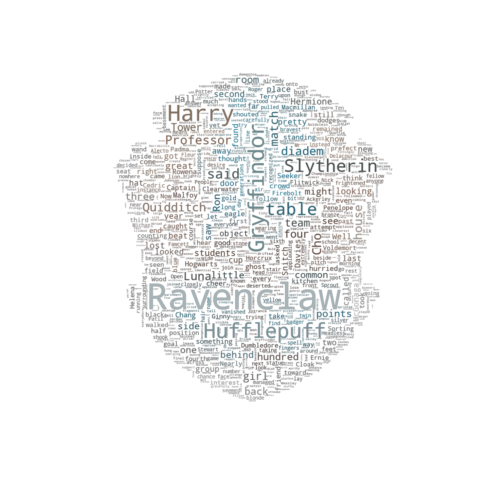
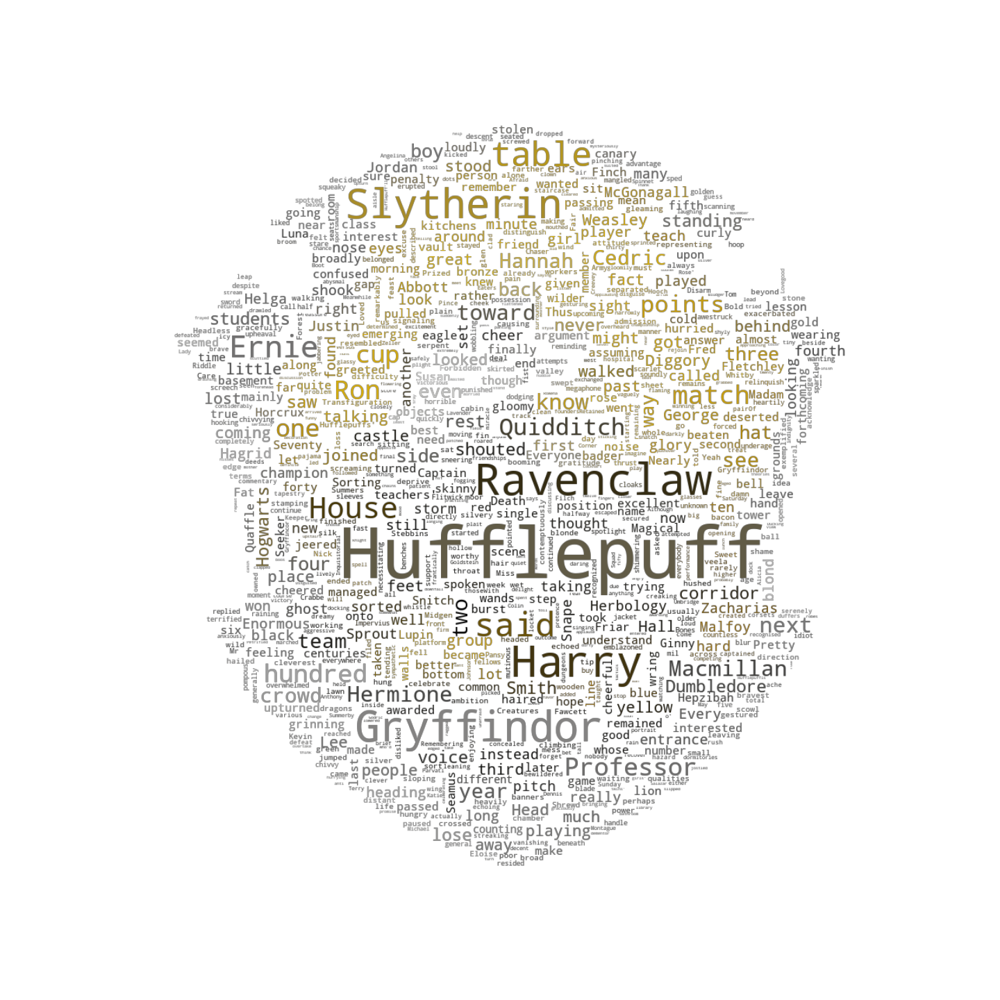
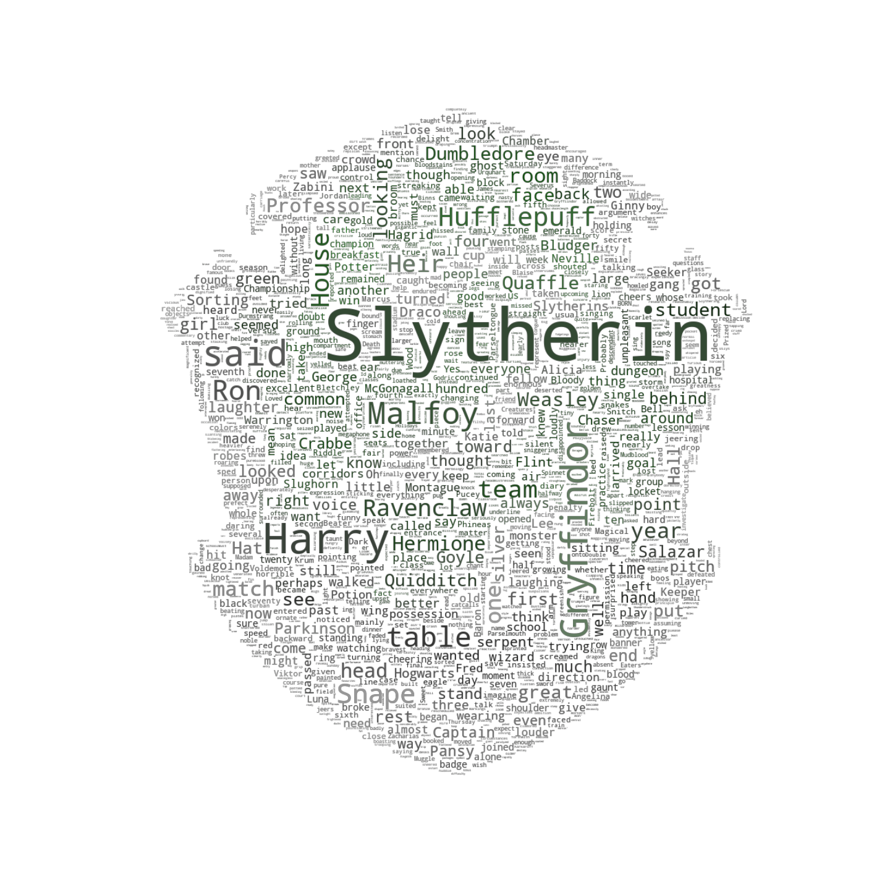
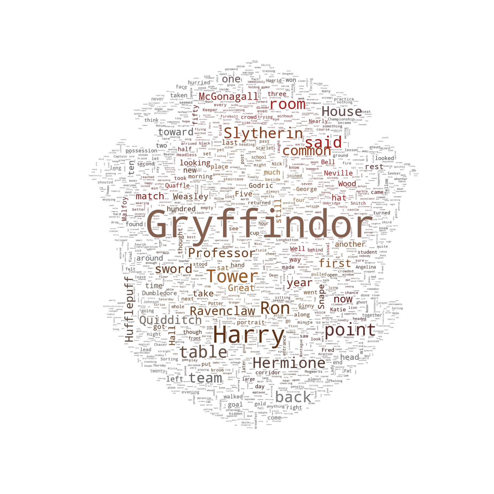

# nlHP

Random NLP tasks with Harry Potter text.  Probably written in python... might use R for more nostalgia and for Harry Pot-R pun potential.

Data gathered from [bradleyboehmke's `harrypotter` R package on GitHub](https://github.com/bradleyboehmke/harrypotter) (tbh, not sure legality of the whole thing, so the data directory is excluded from the repo to avoid redistributing any potentially legally sketchy stuff).

## House Wordclouds

#### Workflow

* Parse books into sentences with `spacy`
* Filter sentences to where each of the houses were mentioned
* Create a wordcloud with each house's sentences using their Pottermore crest as the mask/coloring

#### Output

  

  

  

  

